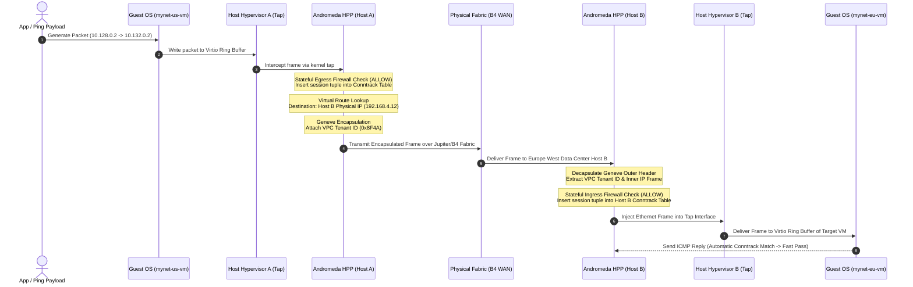
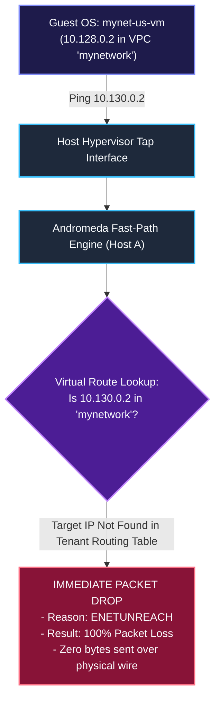

# Low-Level Design (LLD): End-to-End Packet Lifecycle & Traversal

This document details the **Low-Level Design (LLD)** of how a network packet travels from an application running inside a Compute Engine Virtual Machine, through the Linux hypervisor kernel, Andromeda Fast-Path packet processing pipeline, stateful firewall inspection, overlay encapsulation, physical data center fabric, and into the target destination instance.

---

## 1. Complete End-to-End Packet Lifecycle Architecture

When `mynet-us-vm` (`10.128.0.2`) sends an ICMP Echo Request (`ping`) or TCP payload to `mynet-eu-vm` (`10.132.0.2`), the packet traverses **12 discrete processing stages**.

```mermaid
graph TD
    classDef guest fill:#1E1B4B,stroke:#818CF8,stroke-width:2px,color:#F8FAFC;
    classDef hyp fill:#1E293B,stroke:#38BDF8,stroke-width:2px,color:#F8FAFC;
    classDef fw fill:#064E3B,stroke:#34D399,stroke-width:2px,color:#F8FAFC;
    classDef encap fill:#4C1D95,stroke:#C084FC,stroke-width:2px,color:#F8FAFC;
    classDef phy fill:#451A03,stroke:#F97316,stroke-width:2px,color:#F8FAFC;

    S1["STEP 1: Guest Application & Socket Layer<br/>App issues socket(), connect(), sendto() sys calls"]:::guest
    S2["STEP 2: Guest OS Virtio-Net Driver<br/>Frame formatted (Src/Dst MAC), written to virtqueue ring buffer"]:::guest
    S3["STEP 3: Hypervisor Tap Interface<br/>KVM thread intercepts frame from virtqueue onto tap interface"]:::hyp
    S4["STEP 4: Andromeda Host Packet Processor (HPP)<br/>Intercepted by user-space DPDK / SmartNIC fast-path pipeline"]:::hyp
    S5["STEP 5: Stateful Firewall Egress Evaluation<br/>Conntrack lookup + Priority rules check (ALLOW)"]:::fw
    S6["STEP 6: Virtual Routing & NAT Lookup<br/>Route match: 10.132.0.0/20 -> Resolve Host B Physical IP"]:::hyp
    S7["STEP 7: Overlay Tunnel Encapsulation<br/>Attach Geneve Header (VPC Tenant ID: 0x8F4A, VNI, UDP 6081)"]:::encap
    S8["STEP 8: Physical Data Center Fabric<br/>Transmit over 100G NIC -> Jupiter Fabric -> B4 Global WAN Fiber"]:::phy
    S9["STEP 9: Destination Host Decapsulation<br/>Host B Andromeda HPP strips Geneve outer header & extracts Tenant ID"]:::encap
    S10["STEP 10: Stateful Firewall Ingress Evaluation<br/>Conntrack lookup + Ingress rules check (ALLOW)"]:::fw
    S11["STEP 11: Hypervisor Tap Interface Injection<br/>Ethernet frame injected into target VM's tap interface"]:::hyp
    S12["STEP 12: Target Guest OS Delivery & Response<br/>Virtqueue interrupt triggers Target Kernel. ICMP Reply generated"]:::guest

    S1 --> S2 --> S3 --> S4 --> S5 --> S6 --> S7 --> S8 --> S9 --> S10 --> S11 --> S12
```

---

## 2. Sequence Diagram: Intra-VPC Cross-Region Packet Traversal

---

## 3. Header Framing & Encapsulation Mathematical Breakdown

To maintain tenant isolation without hardware VLAN constraints, Andromeda wraps every tenant packet inside a **Geneve (Generic Network Virtualization Encapsulation)** or **STT (Stateless Transport Tunneling)** frame.

### Encapsulated Packet Header Structure

```mermaid
graph TD
    classDef outer fill:#451A03,stroke:#F97316,stroke-width:2px,color:#F8FAFC;
    classDef udp fill:#1E293B,stroke:#38BDF8,stroke-width:2px,color:#F8FAFC;
    classDef geneve fill:#4C1D95,stroke:#C084FC,stroke-width:2px,color:#F8FAFC;
    classDef inner fill:#064E3B,stroke:#34D399,stroke-width:2px,color:#F8FAFC;
    classDef payload fill:#0F172A,stroke:#818CF8,stroke-width:2px,color:#F8FAFC;

    subgraph HeaderStack ["GENEVE OVERLAY PACKET HEADER FRAMING"]
        H1["1. Outer Physical Ethernet Header (14 Bytes)<br/>Src Host A MAC | Dst Gateway MAC | EtherType: 0x0800 (IPv4)"]:::outer
        H2["2. Outer Physical IPv4 Header (20 Bytes)<br/>Src Host A IP (192.168.1.10) | Dst Host B IP (192.168.4.12) | Proto: UDP"]:::outer
        H3["3. Outer UDP Header (8 Bytes)<br/>Src Port: Entropy Hash | Dst Port: 6081 (Geneve Standard Port)"]:::udp
        H4["4. Geneve Header (8 Bytes)<br/>Ver: 0 | Opt Len: 0 | Protocol: 0x6558 | VNI: 24-bit VPC Tenant ID"]:::geneve
        H5["5. Inner Tenant Ethernet Header (14 Bytes)<br/>Src VM MAC (Virtio) | Dst Gateway MAC (04:01:00:00:00:01)"]:::inner
        H6["6. Inner Tenant IPv4 Header (20 Bytes)<br/>Src VM IP: 10.128.0.2 | Dst VM IP: 10.132.0.2 | Protocol: 1 (ICMP)"]:::inner
        H7["7. Inner Tenant Payload<br/>ICMP Echo Request / TCP Payload Data"]:::payload
    end

    H1 --> H2 --> H3 --> H4 --> H5 --> H6 --> H7
```

### Encapsulation Overhead Formula:

$$\text{Total Encapsulation Overhead} = 14\,(\text{Outer Eth}) + 20\,(\text{Outer IP}) + 8\,(\text{Outer UDP}) + 8\,(\text{Geneve}) = 50\text{ Bytes}$$

To accommodate this 50-byte header overhead without fragmentation, the GCP physical network fabric supports Jumbo Frames with an **underlay MTU of 8800 bytes**, allowing tenant VMs to run at standard **1460-byte MTU** or **8850-byte Jumbo MTU** seamlessly.

---

## 4. Cross-VPC Network Isolation Drop Mechanics

When `mynet-us-vm` (`10.128.0.2` in `mynetwork`) attempts to ping `10.130.0.2` (`managementnet-us-vm` in `managementnet`), the packet is dropped at **Stage 6 (Virtual Routing Lookup)**:

Because separate VPC networks maintain completely isolated routing tables in Andromeda's control plane, `mynetwork` has no knowledge of `managementnet`'s subnets. The packet is dropped in host memory without consuming data center bandwidth.

---

## Related Workspace Documents

- [Case Study Index](file:///home/btpl-lap-22/live/gcd/vpc-network/casestudy/README.md)
- [High-Level Architecture (HLD)](file:///home/btpl-lap-22/live/gcd/vpc-network/casestudy/hld-architecture.md)
- [Stateful Firewall Deep Dive](file:///home/btpl-lap-22/live/gcd/vpc-network/casestudy/firewall-deep-dive.md)
- [Compute & Network Integration](file:///home/btpl-lap-22/live/gcd/vpc-network/casestudy/compute-network-integration.md)
