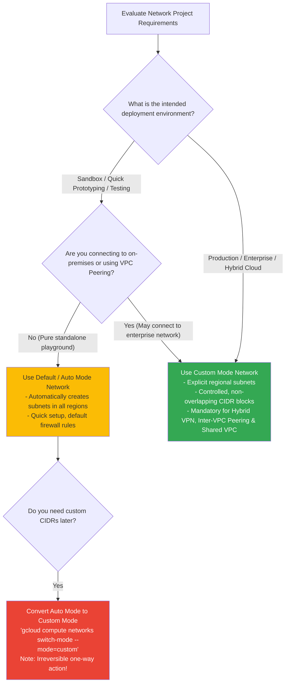
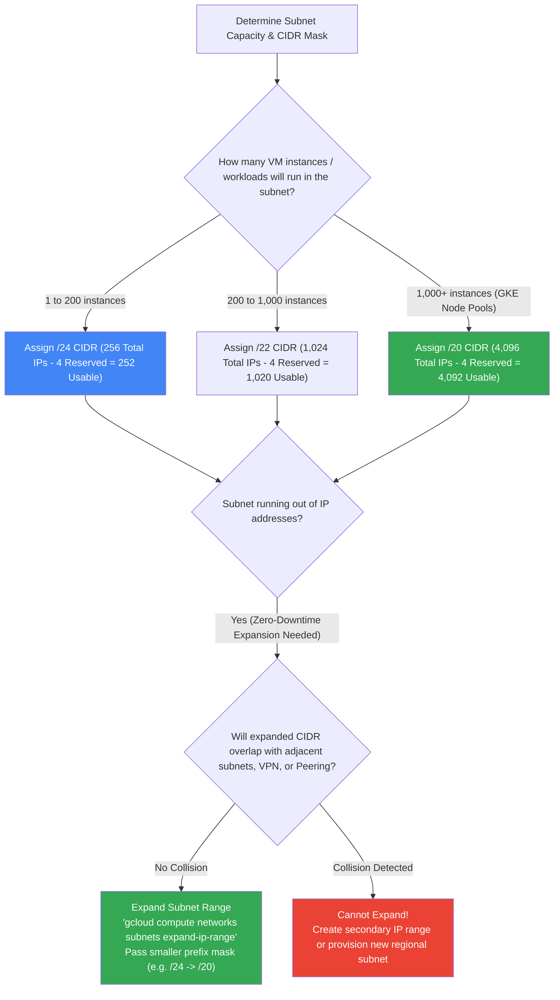
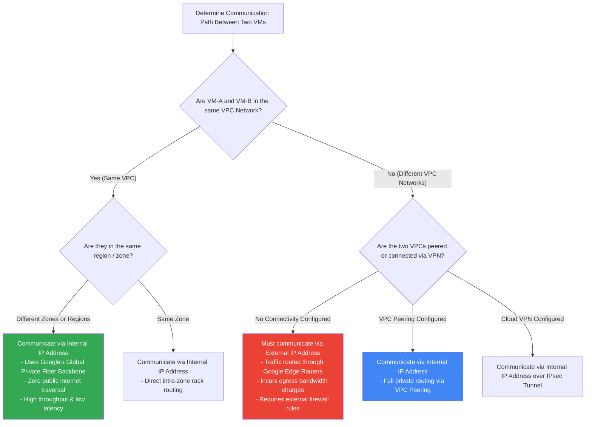
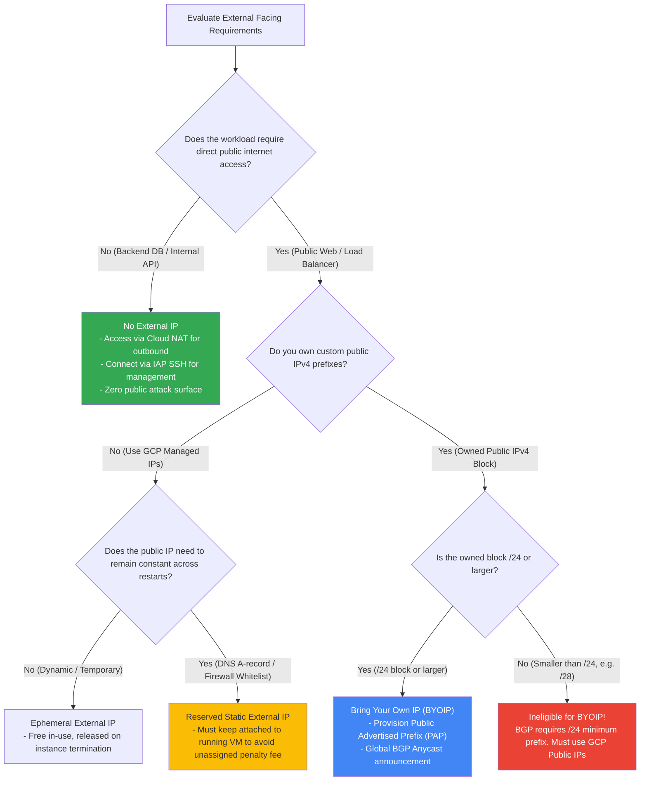
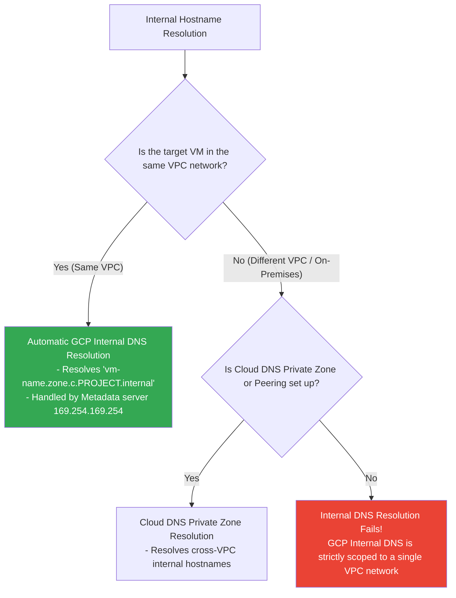
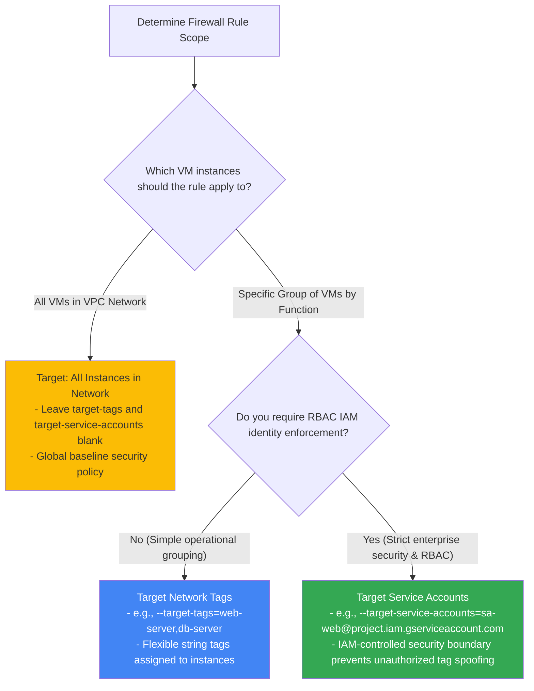

# VPC Networks & Subnets: Decision Trees

This guide provides visual decision trees (Mermaid flowcharts & ASCII text decision paths) for selecting VPC network modes, sizing subnets, planning non-downtime CIDR expansions, external IP strategies, BYOIP, custom routing, and stateful firewall rule targeting.

---

## 1. VPC Network Mode Selection Decision Tree

### ASCII Text Breakdown:
* **Playground / Sandbox**: Default / Auto Mode (`10.128.0.0/9` pre-allocated).
* **Enterprise / Production / Hybrid VPN**: Custom Mode (mandatory to prevent CIDR overlapping).
* **Existing Auto Mode Needing Custom CIDRs**: Convert to Custom Mode (`switch-mode --mode=custom`). **Warning**: One-way conversion!

---

## 2. Subnet Mask Sizing & Non-Downtime CIDR Expansion Decision Tree

---

## 3. Inter-Instance Communication & Routing Decision Tree

---

## 4. External IP Address & BYOIP Strategy Decision Tree

---

## 5. Internal DNS Resolution Boundary Decision Tree

---

## 6. Firewall Rule Target & Security Targeting Strategy Decision Tree

