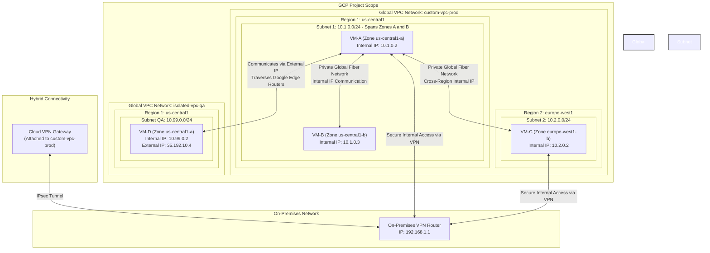
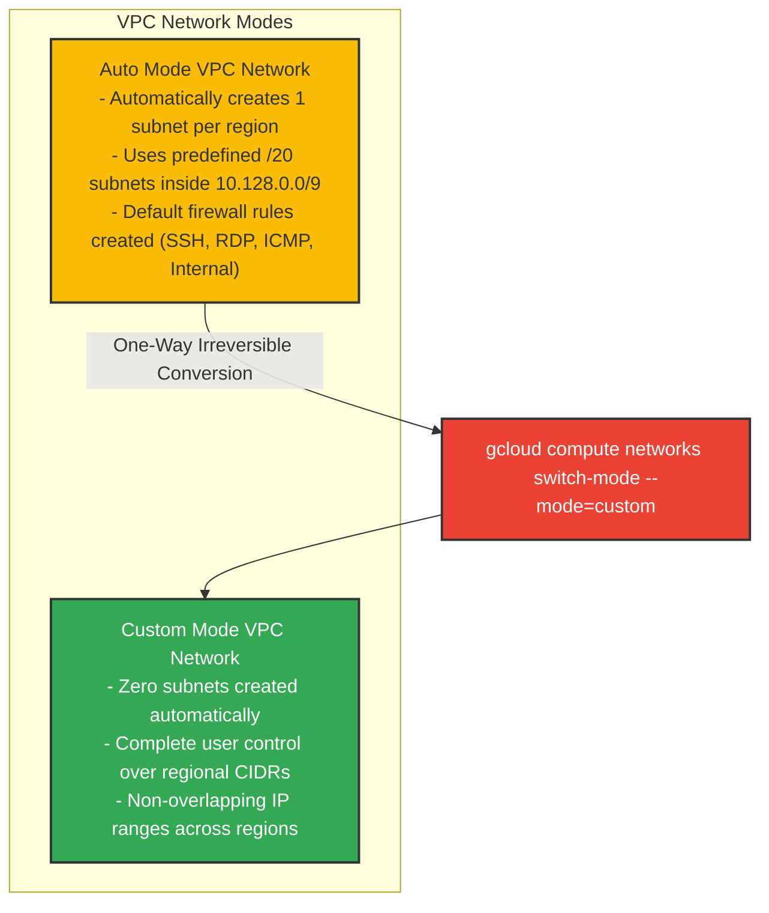
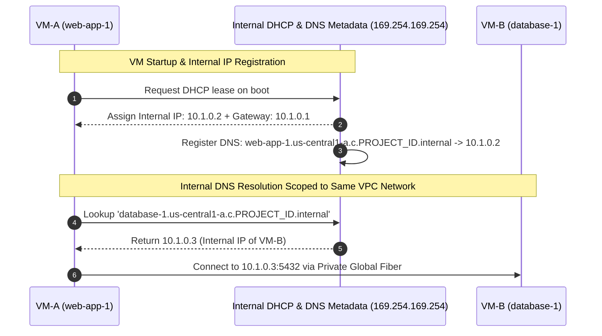
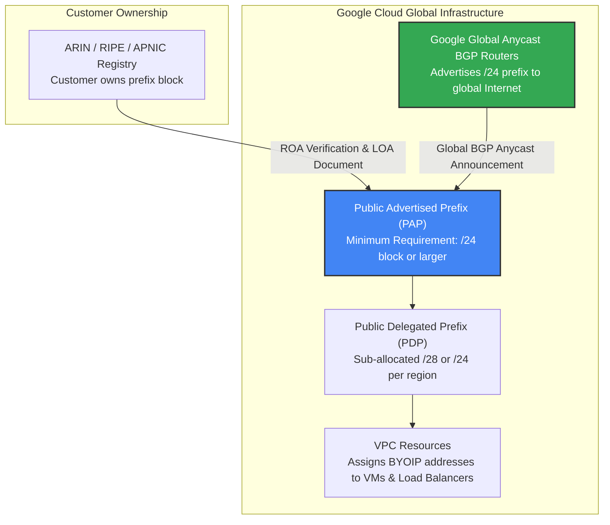

# VPC Networks & Subnets: High-Level & Low-Level Design Architecture

This document presents the **High-Level Design (HLD)** and **Low-Level Design (LLD)** for Google Cloud Platform (GCP) Virtual Private Cloud (VPC) Networks, Regional Subnetworks, IP Address Allocation, Internal DNS Scoping, External IP Billing Mechanics, and BYOIP.

---

## 1. High-Level Design (HLD) Architecture

GCP VPC networks are **global resources**. Unlike traditional cloud providers where a VPC is tied to a single region, a GCP VPC spans all available regions worldwide simultaneously. Inside a global VPC, **subnets are regional resources** that extend across all zones within a given region.



---

## 2. Low-Level Design (LLD) Architecture

### A. Subnet IP Address Allocation & 4 Reserved IP Addresses

In every primary subnet CIDR block, Google Cloud automatically reserves **4 IP addresses**. You cannot assign these 4 reserved addresses to VM instances or load balancers.

```text
Subnet Range Example: 10.1.0.0/24 (Total 256 Addresses: 10.1.0.0 to 10.1.0.255)
┌─────────────────┬───────────────────────────────┬─────────────────────────────────────────────┐
│ Address         │ Status                        │ Function / Description                      │
├─────────────────┼───────────────────────────────┼─────────────────────────────────────────────┤
│ 10.1.0.0        │ Reserved by GCP               │ Network Address (.0)                        │
│ 10.1.0.1        │ Reserved by GCP               │ Subnet Default Gateway (.1)                 │
│ 10.1.0.2        │ Available for Assignment      │ First usable host IP address                │
│ 10.1.0.3        │ Available for Assignment      │ Second usable host IP address               │
│ ...             │ Available for Assignment      │ Usable host range (10.1.0.4 to 10.1.0.253)  │
│ 10.1.0.254      │ Reserved by GCP               │ Second-to-last address (Reserved by GCP)   │
│ 10.1.0.255      │ Reserved by GCP               │ Last address / Subnet Broadcast Address     │
└─────────────────┴───────────────────────────────┴─────────────────────────────────────────────┘
```

---

### B. Network Mode Architecture & Conversion Mechanics

GCP supports two primary modes of VPC creation:



* **Auto Mode**:
  - Automatically provisions one subnet per region within the `10.128.0.0/9` CIDR block using a `/20` prefix mask (e.g., `10.128.0.0/20` in `us-central1`, `10.132.0.0/20` in `europe-west1`).
  - Automatically adds new `/20` subnets when new GCP regions are launched.
  - Can be converted to Custom Mode, but **Custom Mode networks can NEVER be converted back to Auto Mode**.

* **Custom Mode**:
  - Starts with zero subnets.
  - Allows full manual configuration of regional subnets and custom CIDR ranges (RFC 1918 compliant: `10.0.0.0/8`, `172.16.0.0/12`, `192.168.0.0/16`).
  - Essential for enterprise production, hybrid VPN, and VPC Network Peering setups to avoid IP collisions.

---

### C. Zero-Downtime Subnet IP Range Expansion

Google Cloud allows increasing the IP address space of any existing subnetwork **without shutting down workloads or restarting VM instances**.

```text
Initial Subnet Configuration:
Subnet Name: prod-subnet-us
CIDR: 10.1.0.0/24 (256 IP Addresses)
Prefix Mask: /24

Expansion Action (Zero-Downtime):
gcloud compute networks subnets expand-ip-range prod-subnet-us --prefix-length=20

Expanded Subnet Configuration:
Subnet Name: prod-subnet-us
CIDR: 10.1.0.0/20 (4,096 IP Addresses)
Prefix Mask: /20

Expansion Rules & Constraints:
1. The new prefix mask MUST be smaller than the existing mask (e.g., /24 -> /20).
2. Expansion is ONE-WAY. You CANNOT shrink a subnet IP range.
3. Auto mode subnets start at /20 and can only be expanded up to /16 max.
4. Custom mode subnets can be expanded to any valid non-overlapping RFC range.
5. The expanded range MUST NOT overlap with any existing subnet in the same VPC.
```

---

### D. Dual-Stack IPv4 / IPv6 Architecture

Custom VPC networks support **Dual-Stack** configuration:
- **IPv4 Range**: Private internal RFC 1918 CIDR assigned to subnets and VMs.
- **IPv6 Range**: Public or internal `/64` IPv6 range assigned to subnets (`/96` mask per VM instance).
- VMs can communicate over IPv4 and IPv6 simultaneously without NAT gateway translation.

---

### E. Internal DHCP & Network-Scoped Internal DNS Resolution

Every VM created in Google Cloud receives an **Internal IP address** allocated via DHCP. Simultaneously, Google Cloud's metadata server registers the VM's symbolic hostname in an **Internal DNS service**.



#### Internal DNS Scope Boundary Rules:
1. **Network Scope Boundary**: Internal DNS resolution operates **strictly within the same VPC network**.
2. **Cross-VPC DNS Boundary**: A VM in `VPC-1` **cannot** natively resolve the internal hostname of a VM in `VPC-2` via internal DNS, even if external IPs are reachable, unless Cloud DNS Private Zones or VPC Peering with DNS sharing is configured.
3. **Symbolic FQDN Format**: `[INSTANCE_NAME].[ZONE].c.[PROJECT_ID].internal`

---

### F. Ephemeral vs Static External IP Lifecycle & Unassigned Surcharge Mechanics

External IP addresses are optional. GCP provides two categories of public external IPs:

```text
┌──────────────────────────────────────┬────────────────────────────────────────────────────────────────────────┐
│ External IP Type                     │ Lifecycle Behavior & Cost Model                                        │
├──────────────────────────────────────┼────────────────────────────────────────────────────────────────────────┤
│ Ephemeral External IP                │ - Allocated automatically from GCP public IP pool upon instance boot.  │
│                                      │ - Released back to pool when instance is STOPPED or DELETED.           │
│                                      │ - Standard in-use hourly rate while VM is running.                      │
├──────────────────────────────────────┼────────────────────────────────────────────────────────────────────────┤
│ Static External IP (Assigned)        │ - Permanently reserved IP bound to a running VM or forwarding rule.    │
│                                      │ - Retained across VM restarts and stops.                               │
│                                      │ - Standard in-use hourly rate.                                         │
├──────────────────────────────────────┼────────────────────────────────────────────────────────────────────────┤
│ Static External IP (UNASSIGNED)      │ - Reserved static IP NOT attached to any active running VM/rule.       │
│                                      │ - PENALTY BILLING: Charged at a HIGHER hourly rate than in-use IPs    │
│                                      │   to discourage public IP address hoarding.                            │
└──────────────────────────────────────┴────────────────────────────────────────────────────────────────────────┘
```

---

### G. Bring Your Own IP (BYOIP) Architecture

Enterprise customers owning publicly routable IPv4 address space can import their own IP prefixes into Google Cloud using **Bring Your Own IP (BYOIP)**.



#### BYOIP Rules & Eligibility:
1. **Minimum Prefix Size**: Must be a **/24 or larger** IPv4 block (e.g. 256 public IPs). Prefixes smaller than `/24` (e.g. `/25` or `/28`) cannot be advertised globally via BGP over the public internet.
2. **Global BGP Advertisement**: Google advertises the imported `/24` prefix globally using BGP Anycast from Google's edge points of presence.
3. **Zero Downtime Migration**: Existing public IP reputations and whitelist entries are preserved when migrating on-premises services to GCP.
