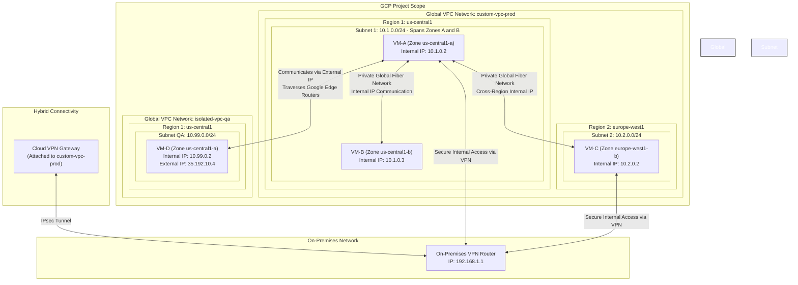
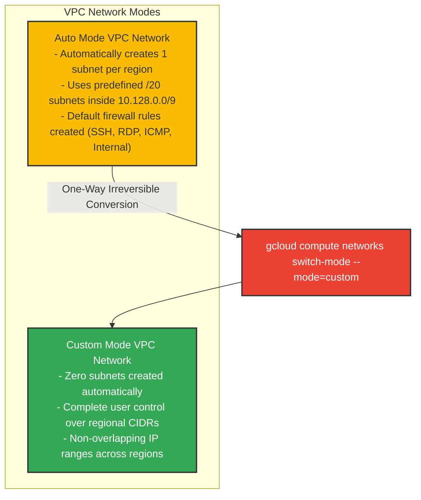
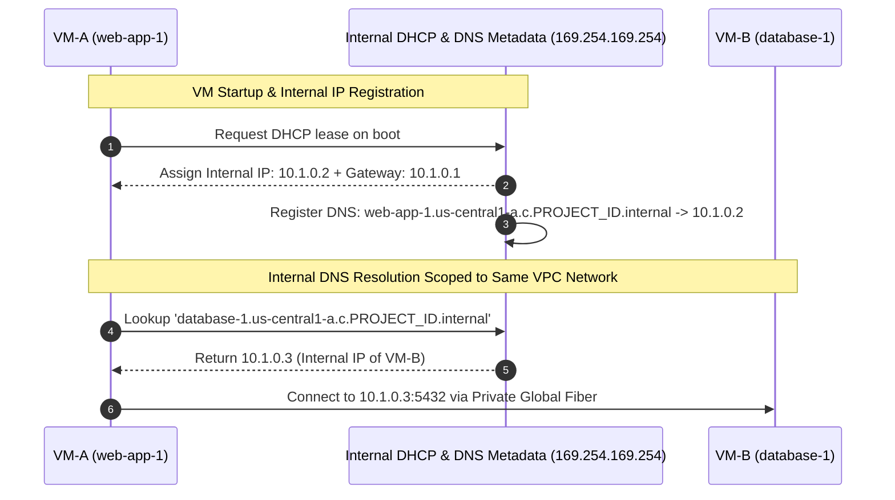
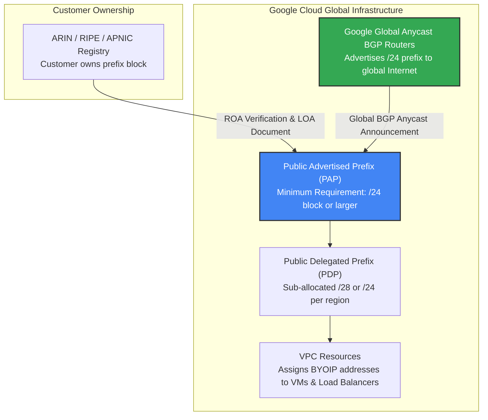
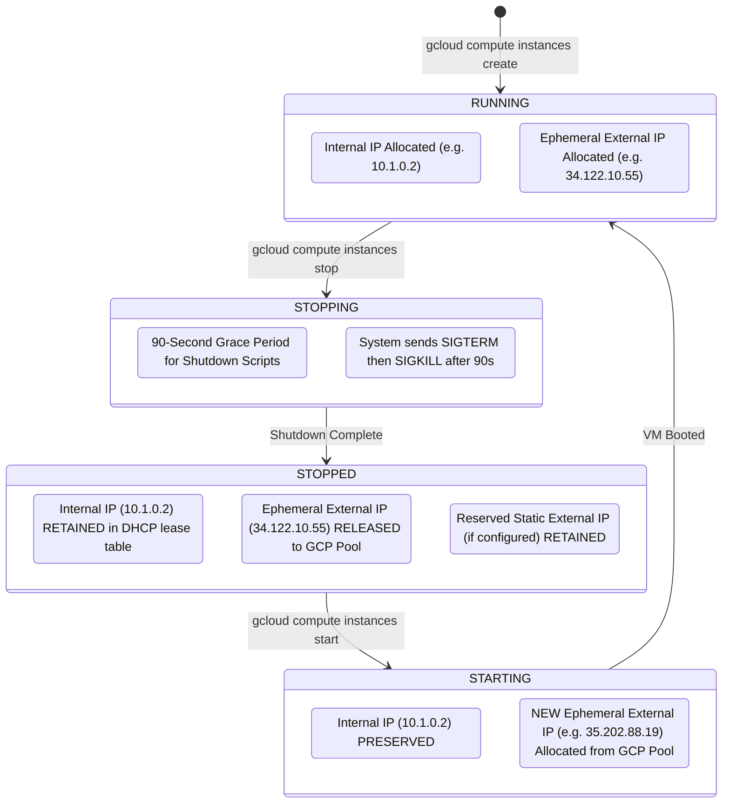
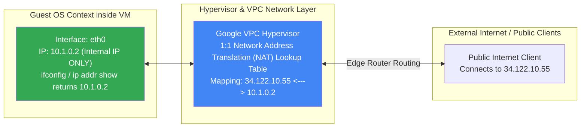
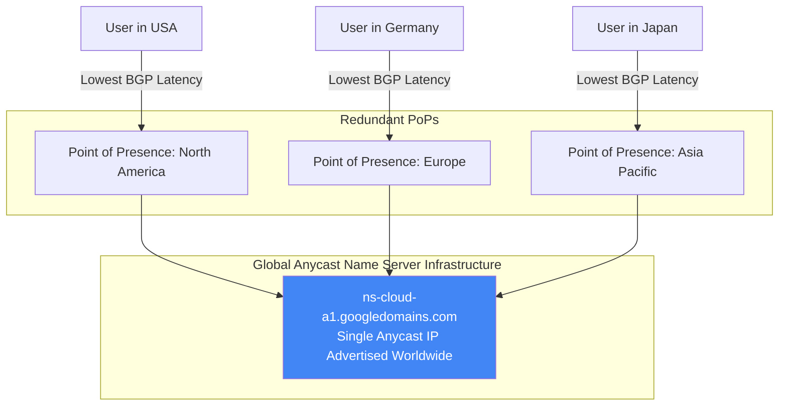
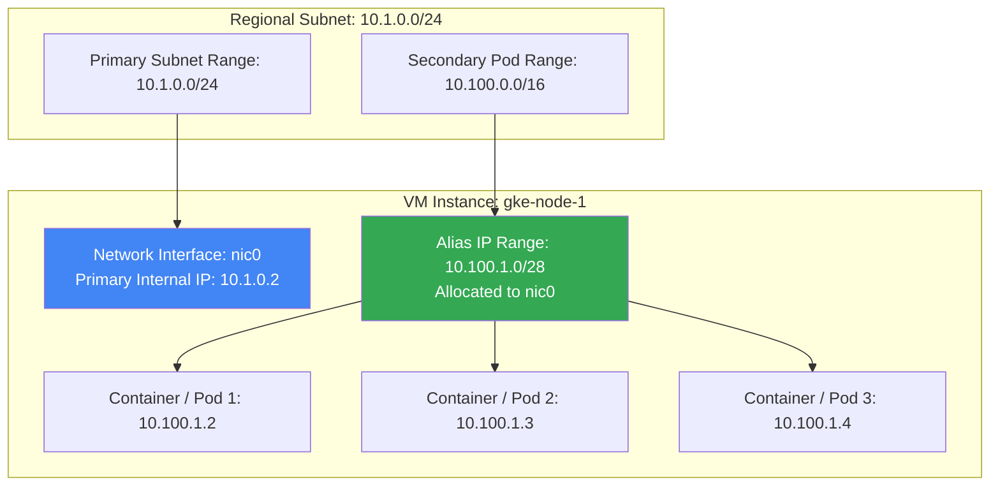
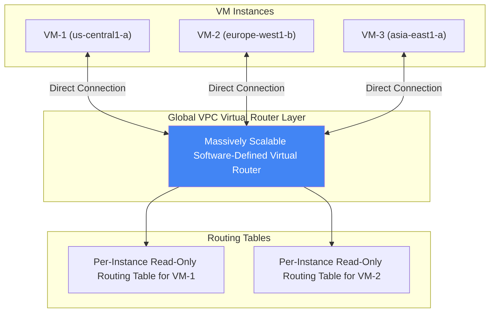
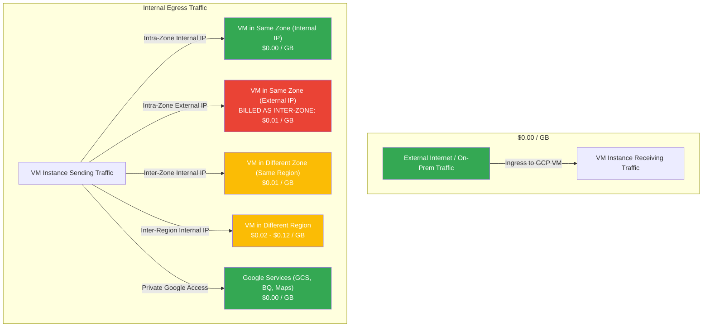

# VPC Networks & Subnets: High-Level & Low-Level Design Architecture

This document presents the **High-Level Design (HLD)** and **Low-Level Design (LLD)** for Google Cloud Platform (GCP) Virtual Private Cloud (VPC) Networks, Regional Subnetworks, IP Address Allocation, Internal DNS Scoping, Cloud DNS SLA, Alias IP Ranges, Virtual Routers, and Distributed Stateful Firewall Rules.

---

## 1. High-Level Design (HLD) Architecture

GCP VPC networks are **global resources**. Unlike traditional cloud providers where a VPC is tied to a single region, a GCP VPC spans all available regions worldwide simultaneously. Inside a global VPC, **subnets are regional resources** that extend across all zones within a given region.



---

## 2. Low-Level Design (LLD) Architecture

### A. Subnet IP Address Allocation & 4 Reserved IP Addresses

In every primary subnet CIDR block, Google Cloud automatically reserves **4 IP addresses**. You cannot assign these 4 reserved addresses to VM instances or load balancers.

```text
Subnet Range Example: 10.1.0.0/24 (Total 256 Addresses: 10.1.0.0 to 10.1.0.255)
┌─────────────────┬───────────────────────────────┬─────────────────────────────────────────────┐
│ Address         │ Status                        │ Function / Description                      │
├─────────────────┼───────────────────────────────┼─────────────────────────────────────────────┤
│ 10.1.0.0        │ Reserved by GCP               │ Network Address (.0)                        │
│ 10.1.0.1        │ Reserved by GCP               │ Subnet Default Gateway (.1)                 │
│ 10.1.0.2        │ Available for Assignment      │ First usable host IP address                │
│ 10.1.0.3        │ Available for Assignment      │ Second usable host IP address               │
│ ...             │ Available for Assignment      │ Usable host range (10.1.0.4 to 10.1.0.253)  │
│ 10.1.0.254      │ Reserved by GCP               │ Second-to-last address (Reserved by GCP)   │
│ 10.1.0.255      │ Reserved by GCP               │ Last address / Subnet Broadcast Address     │
└─────────────────┴───────────────────────────────┴─────────────────────────────────────────────┘
```

---

### B. Network Mode Architecture & Conversion Mechanics

GCP supports two primary modes of VPC creation:



* **Auto Mode**:
  - Automatically provisions one subnet per region within the `10.128.0.0/9` CIDR block using a `/20` prefix mask (e.g., `10.128.0.0/20` in `us-central1`, `10.132.0.0/20` in `europe-west1`).
  - Automatically adds new `/20` subnets when new GCP regions are launched.
  - Can be converted to Custom Mode, but **Custom Mode networks can NEVER be converted back to Auto Mode**.

* **Custom Mode**:
  - Starts with zero subnets.
  - Allows full manual configuration of regional subnets and custom CIDR ranges (RFC 1918 compliant: `10.0.0.0/8`, `172.16.0.0/12`, `192.168.0.0/16`).
  - Essential for enterprise production, hybrid VPN, and VPC Network Peering setups to avoid IP collisions.

---

### C. Zero-Downtime Subnet IP Range Expansion

Google Cloud allows increasing the IP address space of any existing subnetwork **without shutting down workloads or restarting VM instances**.

```text
Initial Subnet Configuration:
Subnet Name: prod-subnet-us
CIDR: 10.1.0.0/24 (256 IP Addresses)
Prefix Mask: /24

Expansion Action (Zero-Downtime):
gcloud compute networks subnets expand-ip-range prod-subnet-us --prefix-length=20

Expanded Subnet Configuration:
Subnet Name: prod-subnet-us
CIDR: 10.1.0.0/20 (4,096 IP Addresses)
Prefix Mask: /20

Expansion Rules & Constraints:
1. The new prefix mask MUST be smaller than the existing mask (e.g., /24 -> /20).
2. Expansion is ONE-WAY. You CANNOT shrink a subnet IP range.
3. Auto mode subnets start at /20 and can only be expanded up to /16 max.
4. Custom mode subnets can be expanded to any valid non-overlapping RFC range.
5. The expanded range MUST NOT overlap with any existing subnet in the same VPC.
```

---

### D. Dual-Stack IPv4 / IPv6 Architecture

Custom VPC networks support **Dual-Stack** configuration:
- **IPv4 Range**: Private internal RFC 1918 CIDR assigned to subnets and VMs.
- **IPv6 Range**: Public or internal `/64` IPv6 range assigned to subnets (`/96` mask per VM instance).
- VMs can communicate over IPv4 and IPv6 simultaneously without NAT gateway translation.

---

### E. Internal DHCP & Network-Scoped Internal DNS Resolution

Every VM created in Google Cloud receives an **Internal IP address** allocated via DHCP. Simultaneously, Google Cloud's metadata server registers the VM's symbolic hostname in an **Internal DNS service**.



#### Zonal DNS vs Legacy Global DNS:
- **Zonal DNS (Recommended)**: `[INSTANCE_NAME].[ZONE].c.[PROJECT_ID].internal`. Recommended by Google for fault tolerance; isolates DNS registration failures to single zones.
- **Global DNS (Legacy)**: `[INSTANCE_NAME].c.[PROJECT_ID].internal`. Project-wide scope; vulnerable to cross-zone failure propagation.
- **Metadata Resolver (`169.254.169.254`)**: Intercepts local VPC DNS queries and routes public domain lookups to Google Public DNS (`8.8.8.8`).

---

### F. Ephemeral vs Static External IP Lifecycle & Unassigned Surcharge Mechanics

External IP addresses are optional. GCP provides two categories of public external IPs:

```text
┌──────────────────────────────────────┬────────────────────────────────────────────────────────────────────────┐
│ External IP Type                     │ Lifecycle Behavior & Cost Model                                        │
├──────────────────────────────────────┼────────────────────────────────────────────────────────────────────────┤
│ Ephemeral External IP                │ - Allocated automatically from GCP public IP pool upon instance boot.  │
│                                      │ - Released back to pool when instance is STOPPED or DELETED.           │
│                                      │ - Standard in-use hourly rate while VM is running.                      │
├──────────────────────────────────────┼────────────────────────────────────────────────────────────────────────┤
│ Static External IP (Assigned)        │ - Permanently reserved IP bound to a running VM or forwarding rule.    │
│                                      │ - Retained across VM restarts and stops.                               │
│                                      │ - Standard in-use hourly rate.                                         │
├──────────────────────────────────────┼────────────────────────────────────────────────────────────────────────┤
│ Static External IP (UNASSIGNED)      │ - Reserved static IP NOT attached to any active running VM/rule.       │
│                                      │ - PENALTY BILLING: Charged at a HIGHER hourly rate than in-use IPs    │
│                                      │   to discourage public IP address hoarding.                            │
└──────────────────────────────────────┴────────────────────────────────────────────────────────────────────────┘
```

---

### G. Bring Your Own IP (BYOIP) Architecture

Enterprise customers owning publicly routable IPv4 address space can import their own IP prefixes into Google Cloud using **Bring Your Own IP (BYOIP)**.



---

### H. VM Stop/Start State Machine & IP Retention / Release Mechanics

When a VM instance undergoes a **Stop** and **Start** lifecycle transition, GCP handles its internal and external IP addresses according to strict state rules.



---

### I. Hypervisor 1:1 NAT Mapping & Guest OS IP Non-Awareness

In Google Cloud VPC, **the VM Guest OS is completely unaware of its External IP address**.



* **OS Inspection Behavior**: Running `ifconfig` or `ip addr show` inside Linux/Windows guest OS displays **only the private internal IP address** (`10.1.0.2`).
* **VPC Hypervisor 1:1 NAT**: The VPC hypervisor intercepts inbound packets sent to `34.122.10.55`, rewrites the destination header to `10.1.0.2` via transparent lookup table, and forwards it to `eth0`.

---

### J. Cloud DNS Anycast Managed Architecture (100% Uptime SLA)

GCP Cloud DNS is a managed, authoritative DNS service running on Google's global Anycast infrastructure.



* **100% Uptime SLA**: Google Cloud offers a **100% SLA for Cloud DNS** because domain resolution failure equates to complete internet unreachability.

---

### K. Alias IP Ranges Architecture for Multi-Service / Container Hosting

Alias IP Ranges allow assigning secondary internal IP CIDRs to a VM instance's primary network interface (`nic0`).



* **Container / Kubernetes Pod Networking**: Enables Docker containers or Kubernetes Pods hosted on a single VM to have native VPC internal IP addresses without creating multiple NICs or overlay networks.

---

### L. Massively Scalable Virtual Router Architecture

Every VPC network contains a software-defined, massively scalable **Virtual Router** at its core.



#### Routing Protocol Mechanics:
1. **Direct Virtual Connection**: Every VM connects directly to the Virtual Router layer.
2. **Per-Instance Read-Only Routing Tables**: Compute Engine generates a custom read-only routing table for each VM based on the VPC Routes collection.
3. **Route Priority Matching**: Packets leaving a VM are matched against the routing table by **Longest Prefix Match (LPM)** first, then by **Priority** (lower integer value = higher priority).

---

### M. Distributed Stateful Firewall Architecture & Session Tracking

GCP Firewall Rules function as a **Distributed Stateful Firewall** enforced directly at the hypervisor level of each VM.

```mermaid
graph TD
    subgraph VPC Network Layer
        subgraph Hypervisor Firewall Guard (VM-1 Boundary)
            STATE_TABLE["Stateful Connection Tracking Table<br/>Tracks active TCP/UDP sessions"]
            RULES["Firewall Rule Evaluation<br/>Evaluated by Direction, Priority, Tags, Ports"]
        end
    end

    CLIENT_IN["Inbound Connection Request"] --> RULES
    RULES -->|If Allowed by Ingress Rule| STATE_TABLE
    STATE_TABLE -->|Delivered to VM-1| VM_PROCESS["VM Guest Process"]

    VM_PROCESS -->|Return Response Traffic| STATE_TABLE
    STATE_TABLE -->|AUTOMATICALLY ALLOWED<br/>Stateful Return Traffic bypassing Egress Rules| CLIENT_IN

    style STATE_TABLE fill:#34A853,color:#fff
    style RULES fill:#4285F4,color:#fff
```

#### Stateful Firewall Rules & Implied Defaults:
1. **Stateful Session Tracking**: All firewall rules are stateful. Once a connection is allowed in one direction (ingress or egress), return traffic in the opposite direction is **automatically permitted** regardless of firewall rules.
2. **Implied Default Rules**:
   - **Implied Deny Ingress (Priority 65535)**: Blocks all inbound traffic unless explicitly allowed.
   - **Implied Allow Egress (Priority 65535)**: Allows all outbound traffic from VMs unless explicitly denied.
3. **Rule Components**: Direction (Ingress/Egress), Priority (0 to 65535), Target (Tags / Service Accounts), Source/Destination (CIDR / Tags / Service Accounts), Protocol/Port, Action (Allow / Deny).

---

### N. Network Pricing & Egress Traffic Cost Flow Architecture

Understanding GCP network traffic billing mechanics is critical for architecture cost optimization.



#### Cost Optimization Architectural Guidelines:
1. **Always Use Internal IPs for Intra-Zone Traffic**: Intra-zone egress over internal IP is **$0.00/GB**. Sending intra-zone traffic via external IPs forces routing through external NAT, incurring a **$0.01/GB inter-zone surcharge**.
2. **Enable Private Google Access**: Route traffic to Google Cloud APIs (Storage, BigQuery, KMS) internally via Private Google Access for **$0.00/GB egress cost**.
3. **Release Unassigned Static IPs**: Unassigned static external IPs incur a hourly surcharge to prevent public IPv4 address hoarding.
4. **Locate Microservices in Same Zone**: High-throughput inter-service traffic should be co-located within the same availability zone to avoid inter-zone network fees ($0.01/GB each way).
